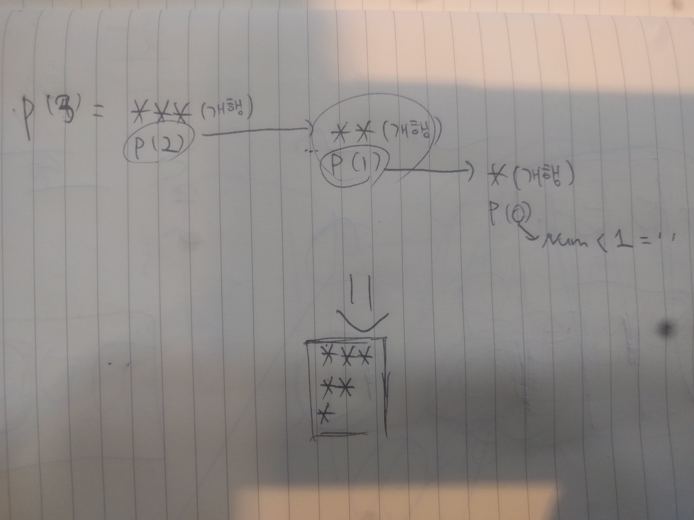

[Algorithm JavaScript] Level1. 역삼각형 출력하기

### Question

#### Source https://programmers.co.kr/learn/challenge_codes/113

> printReversedTriangle 메소드는 양의 정수 num을 매개변수로 입력받습니다.
> 다음을 참고해 `*`(별)로 높이가 num인 삼각형을 문자열로 리턴하는 printReversedTriangle 메소드를 완성하세요
>
> 높이(num)가 3일때 다음과 같은 문자열을 리턴하면 됩니다.
>
> ```
> ***
> **
> *
> ```

### My solution

```javascript
function printReversedTriangle(num) {
 return num<1?'':'*'.repeat(num)+'\n'+printReversedTriangle(num-1)
}

// 아래는 테스트로 출력해 보기 위한 코드입니다.
console.log("결과 : " +'\n'+ printReversedTriangle(3));
```

이전에 삼각형 출력하기의 Best of Best 답변이 바로 기억이나 활용했다. 삼항연산자의 조건으로 인자로 받은 Number값이 1보다 작을시 즉 0일때인지를 물었다. true일때는 빈 문자열 반환해 최종 return값에 영향이 없도록 했다. 그리고 false일때는 재귀함수가 실행되도록 했다. *를 인자로 받은 수 만큼 반복한 후 개행 문자를 추가한다. 그리고 해당 함수에 인자로 받은 Number값에 -1를 다시 인자를 준 함수가 실행되도록 했다.

대충 그림으로 그린다면 아래와 같다.



javascript에서 재귀함수에 대한 설명과 예제가 잘 나와있는 [링크](http://webclub.tistory.com/72)(출처: 웹클럽)

#### Other Solutions

#### Best of Best

```javascript
function printReversedTriangle(num) {
  var result = ''
  // 함수를 완성하세요
  while(num>0){result+=Array(num+1).join("*")+'\n';num--}
  return result
}
// 아래는 테스트로 출력해 보기 위한 코드입니다.
console.log("결과 : " +'\n'+ printReversedTriangle(3));
```

이해하는데 시간이 좀 걸린 풀이였다. 4개의 빈 항목이 들어있는 배열을 생성하고 join메소드를 활용해서 *를 기준으로 모든 항목을 합친 문자열을 반환하는 풀이다. 효율적인가에 대해서는 잘 모르겠지만 repeat말고도 반복하는 무언가를 반환하는 새로운 방법이란 생각이 든다.