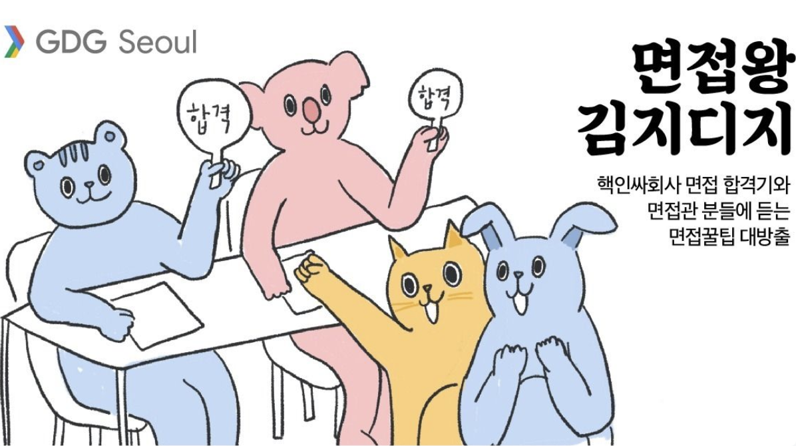
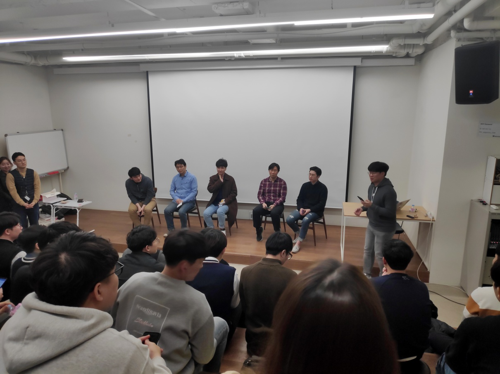

# 면접왕 김지디지 후기

혹시나 오게될지 모르는 이직의 순간을 대비하기 위해 GDG 에서 개최하는 `면접왕 김지디지` 라는 행사에 참석했다.

메가존 사옥 지하는 처음가는 곳이었는데 소규모 밋업을 진행하기 굉장히 무난한 곳인듯하다.

예상대로 나같은 중고신입(?)보다는 신입 공채를 위해 현장에 온 친구들이 많은듯하다.

## 개별 발표

**먼저 발표하신 분은 카카오모빌리티 정현석님이다.** PPT 가 없는 날것(?)의 발표였다. 처음엔 준비가 안된 발표라고 느끼기도 했지만 면접에 대한 경험을 있는 있는 그대로 담담하게 잘 얘기해주셨다고 생각한다. 이 분은 신입 개발자 분이고 대기업 두 곳 그리고 카카오모빌리티 최종 면접에 합격하셨다고 한다. 한 대기업은 기술면접을 분량이 적고 인성면접을 오랬동안 봤는데 특정 인재상에 대해 집요하게 물어봤다고 한다. 또 다른 대기업은 기술면접을 아주 깊고 넓게 물어봤다고 한다. 카카오모빌리티는 프로그래머스에서 진행한 코딩테스트 이후에 인성면접 중심으로 진행되었고 잘 알려져있듯이 편안하게 대화하는 분위기로 진행되었다고 한다.

면접때 특별히 멘트를 잘 했다기보다는 개발 여러 분야에 도전했었고 공모전 6 회 수상했던 이력을 스토리텔링에 잘 녹여서 표현했다는 점을 합격포인트로 소개했다.

**다음 발표하신 분은 스타트업 Additor 의 장지원 대표님이 진행하셨다.** 산전수전 다 겪은 CEO 답게 발표자료도 풍성하고 화법도 막힘이 없었다. 그 풍성했던 내용의 핵심은 스타트업이 원하는 개발자는 **비전에 공감하는 개발자**라는 것이다. 이에 생산적인 프로세스와 성장을 위한 노력, 그리고 성취를 위해 끊임없이 노력까지 더해지면 스타트업 대다수가 원하는 개발자일 것이고 특히 Additor 가 더욱 채용하고 싶은 개발자라는 것이다. 이에 뚜렷한 강점을 잘 어필하고 내가 이 회사와 잘 맞는지, 꼭 필요한 사람인지를 꼭 정리하고 지원하기를 당부했다.

아직 10 명이 안되는 작은 스타트업이지만 스크럼 스프린트나 코드 리뷰, 회고 등 개발자라면 누구나 경험하고 싶은 촘촘한 개발 문화를 지닌것도 굉장히 인상이 깊었다. 웹프론트엔드가 개발 전체에서 굉장히 중요한 요소인 제품을 서비스하고 있기 때문에 프론트엔드 개발자인 나로서도 굉장히 매력이 느껴지는 회사였다.

**마지막으로 우아한형제들 임성현님께서 마무리 발표를 하셨다.** 실제로 면접관으로서 많이 묻는 면접 질문들을 몇가지 뽑아서 질문의 의도와 원하는 답변의 흐름을 정리해서 알려주셨다. 실제로 20 년차 개발자이시고 프로 면접관이시기 때문에 발표 내용이나 발표 진행도 베테랑이라는게 단번에 느껴졌다. 이 밋업은 주니어들을 위한 밋업이었기 때문에 **학습능력**에 대해 묻는 질문들을 많이 소개해주셨다. 뭔가 당연한 질문들이지만 깊이 있는 대답에 대해서는 많이 생각 못했었는데 이번 기회로 새롭게 정리해야할 필요성을 느끼게 되었다.

## 패널 토크

패널토크에서는 레진엔테인먼트의 백엔드 개발자분과 레이니스트의 안드로이드 개발자분이 같이 합류하셨다. 신입으로 지원하는 주니어 개발자 분들이 많았기 때문에 예상되었던 기본 질문들이 많이 쏟아져나왔다. 나 자신도 굉장히 궁금했던 요즘 코딩테스트 방법에 대해서는 **대체로 알고리즘은 이 사람의 최소 실력을 판단하는 정도의 척도로 판단하고 실제 업무에서 일을 잘 할 수 있는지에 대한 과제를 내준다는 방향**으로 설명해주셨다. 뭔가 오늘의 가장 큰 수확(?)인듯하다. 이직하면 무조건 코딩테스트, 코딩테스트는 알고리즘이라는 고정관념이 있었는데 실무에 맞는 방향으로 코딩테스트도 변화해가고 있었다. 프론트엔드 개발자로서 1 년정도 일했지만 아직은 알고리즘 푸는 능력이 프론트엔드 개발중 맞닥뜨리는 문제를 해결하는 능력과 큰 연관성이 느껴지지 않는다고 생각한다. 앞으로 공부의 방향을 조금씩 바꿔나가야한다는 깨달음을 얻었던 중요한 순간이었다.

성장가능성을 판단할 수 있는 척도가 될 수 있는 공부하는 방법이라던지, 그리고 그것을 기록해나가는 깃헙, 블로그의 중요성에 대해서도 여러번 강조해주셨다. 특히 깃헙에 올린 프로젝트는 모두 컴파일, 빌드 다 해볼정도로 꼼꼼하게 보는 편이니 어설프게 관리하지 말라는 말도 당부해주셨다.

한 분 한 분 진심을 담은 답변에 나 자신도 몰입하게 되고 듣는 청중들인 주니어 개발자들 모두가 대체로 만족감을 느끼는것 같았다. 나도 이직을 결정하고 실행하는 순간이 오겠지만 온다면 오늘 알차게 들었던 이 밋업이 꼭 기억에 남을것 같다.
