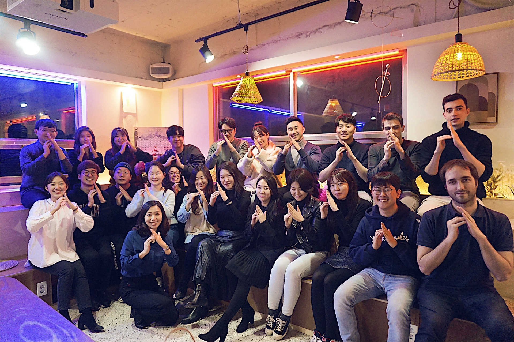
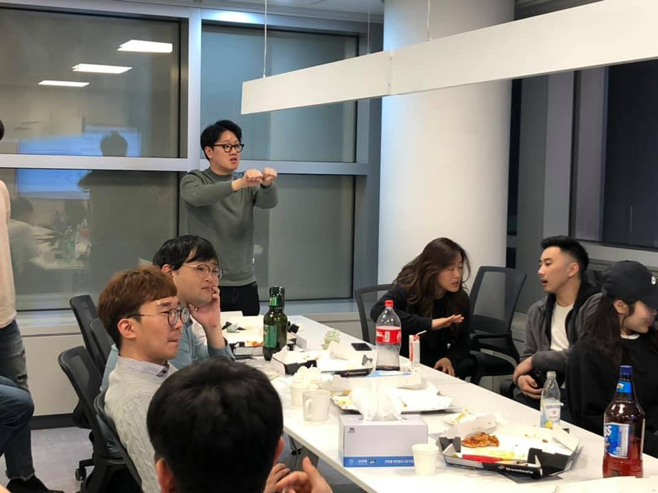

## 2020년 1분기가 끝나는 와중에 쓰는 2019년 회고

### 1. 2019년 개발자로서의 발자취

1. 데일리금융그룹 노매드커넥션 재직(~2019.06)
2. 이직 준비(2019.06~2019.08)
3. 아드리엘 이직(2019.08~ 현재)

### 2. 2019년엔 개발자로서 성장을 위해 무엇을 했는가

1. 공부한 기술
   1. Ramda.js(함수형 프로그래밍)
   2. Vue.js
2. 참여한 컨퍼런스
   1. [GDG Seoul 면접왕 김지디지](https://beomyeonandrewkim.github.io/posts/etc/kim-gdg)
   2. [세번째 콘샐러드 by 뱅크샐러드](https://beomyeonandrewkim.github.io/posts/etc/third-consalad)
3. 블로그 포스팅
   1. Reactjs.org 한국어 번역 프로젝트 참여
      1. [Rules of Hooks](https://beomyeonandrewkim.github.io/posts/react/rules-of-hooks)
      2. [Optimizing Performance](https://beomyeonandrewkim.github.io/posts/react/optimizing-performance)
   2. [CRAv3 Release note 번역](https://beomyeonandrewkim.github.io/posts/react/create-react-app-v3)
   3. [함수형 프로그래밍을 적용하면서](https://beomyeonandrewkim.github.io/posts/javascript/looking-functional-programming)

### 3. 총평

내가 성장을 위해 노력한 점이 있나 싶을 정도로 부끄러운 한해였다. 훌륭한 개발자가 되기 위해 노력은 거의 전무했다고 하면 되겠다.

다만 이직을 운좋게 잘해서 그런지 `함수형 프로그래밍`이라는 새로운 컨셉을 배워나갈 수 있었다. 극강의 코드 복잡도 개선과 함수들의 의미만 따라가면서 손쉽게 이해할 수 있는 흐름이 너무 만족스러웠다. 물론 디버깅의 어려움도 있고 모든 기능을 함수형으로 짜기엔 아직 한계가 보이기도 한다.

Vue.js를 차용하고 있고 TypeScript를 쓰고 있지 않기 때문에 현재의 주류와는 조금 거리가 있지만 미래에 투자하고 있는 마음가짐으로 즐겁게 개발을 하고 있다. 이건 마치 주식투자와 같은 기분? ㅎㅎ

이렇게 개발자의 성장으로서는 부족하고도 부족한 한해였지만 사람으로서의 나는 충분히 성장하지 않았나 싶다. 사람으로서의 내 자신을 되찾고 건강한 멘탈을 가지도록 노력했던 한해였던 것 같다. 그러한 노력은 성공으로 평가될만한 해였다.

이직한 회사는 이러한 나의 사람으로서 성장에 가장 큰 역할을 했다. 서로를 응원해주고 각자의 주장을 존중해준다. 대표님은 나에게 충분히 좋은 사람이고 능력이 있는 사람이라고 편지를 써준다.

나의 2019년을 채워준 영광의 아드리엘

하루에 대부분을 보내는 회사에서 이러한 취급을 받다보니 고질병인 바닥찍는 자존감이 많이 회복되었다. 그래서 그런지 주변에 사람도 많아졌고 술자리도 많아졌다. 덕분에 내 간은 너무 괴로워했던 한해이기도 했다.

내가 저렇게 주장(?)을 한다

내 인생에 이런 시기가 다시 올까 싶다. 충분히 더 많은 살날이 남았지만 과감하게 지금이 인생의 전성기라고 자신있게 말 할 수 있다.

내가 저런 말을 할 수 있도록 만들어준 너무 감사한 2019년이었다.
