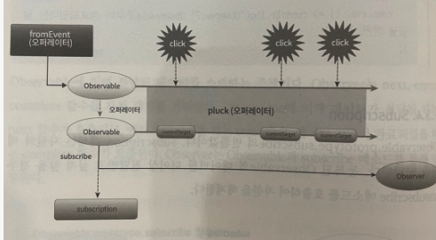

# Chapter 01 RxJS란 무엇인가

## 1.1 RxJS란?

> RxJS는 Observable을 사용하여 비동기 및 이벤트 기반 프로그램을 작성하기 위한 라이브러리다.

- 범용적인 데이터 플로우 솔루션을 지향하는 라이브러리
- 이벤트용 lodash
- 비동기 컬렉션 데이터를 다루는 라이브러리

## 1.2 RxJS 시작하기

- 기본 예제

```jsx
// 보통
const eventHandler = event => {
  console.log(event.currentTarget);
};
document.addEventListener('click', eventHandler);

// RxJS 적용
const { fromEvent } = rxjs;
const click$ = fromEvent(document, 'click'); // observable
const observer = event => console.log(event.currentTarget);
click$.subscribe(observer);

//개선 pluck 적용
const { pluck } = rxjs.operators;

const currentTarget$ = fromEvent(document, 'click').pipe(
  pluck('currentTarget')
); // observable
const observer = target => console.log(target);
click$.subscribe(observer);
```

- Array

```jsx
// 보통
const users = [
	{
		name: '유비',
		birthYear: 161,
		nationality: '촉'
	},
	{
		name: '손권'
		birthYear: 182,
		nationality: '오'
	},
	{
		name: '관우',
		birthYear: 160,
		nationality: '촉',
	}
].filter(user => user.nationality === '촉');

const log = user => console.log(user);
users.forEach(log);

// RxJS
const { from } = rxjs;
const { filter } = rxjs.operators;

const users$ = from([
	{
		name: '유비',
		birthYear: 161,
		nationality: '촉'
	},
	{
		name: '손권',
		birthYear: 182,
		nationality: '오'
	},
	{
		name: '관우',
		birthYear: 160,
		nationality: '촉',
	}
]).pipe(
	filter(user => user.nationality === '촉')
);

const observer = user => console.log(user);
users$.subscribe(observer);
```

## 1.3 RxJS 4대 천왕

- Observable
  - 시간을 축으로 연속적인 데이터를 저장하는 컬렉션을 표현하는 객체
  - 데이터를 제공하는 소스를 Observer에게 전달
  - 스트림(Stream)
- 오퍼레이터
  - Observable을 생성 및 조작하는 함수
  - Observable을 생성, 연결, 분리, 합침
  - 현재의 Observable 인스턴스를 기반으로 항상 새로운 Observable 인스턴스를 반환
- Observer
  - Observable에 의해 전달된 데이터를 소비하는 주체
  - next, error, complete 함수를 가진 객체

```jsx
// Observer 객체를 전달하는 subscribe
const observer = {
  next: value => console.log(value),
  error: error => console.error(error),
  complete: () => console.log('complete'),
};

// next 콜백 함수를 전달하는 subscribe
click$.subscribe(value => console.log(value));

// next, error, complete 콜백 함수를 전달
click$.subscribe(
  value => console.log(value),
  err => console.error(error),
  () => console.log('complete')
);
```

- Subscription
  - Observer.prototype.subscribe의 반환값
  - 자원의 해제
  - 등록된 Observable의 데이터를 더이상 전달받고 싶지 않을 경우 unsubscribe 호출

```jsx
const subscription = currentTarget$.subscribe(observer);

subscription.unsubscribe();
```

## 1.4 RxJS 개발 방법



- 데이터 소스를 Observable로 변경
- 오퍼레이터를 통해 데이터를 변경하거나 추출, 또는 여러 개의 Observable을 하나의 Observable로 합치거나 하나의 Observerable을 여러개의 Observable로 만듦
- 원하는 데이터를 받아 처리하는 Observer를 만듦
- Observer의 subscribe를 통해 Observer를 등록
- Observable 구독을 정지하고 자원을 해지

출처 [RxJS Quick Start](https://m.yes24.com/Goods/Detail/62601794)
