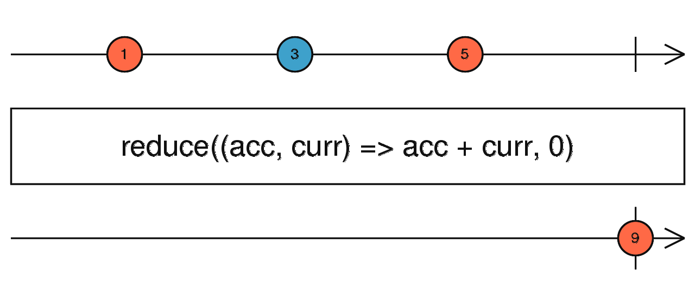
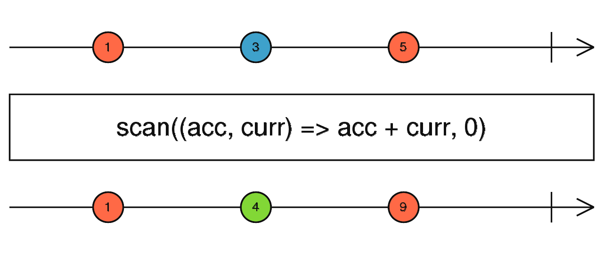

## 1.1 상태관리

### 1.1.1 scan과 reduce

1. reduce

- Observable이 완료(complete)가 되었을때 한 번 데이터가 전달된다. Array의 reduce와 같이 모든 데이터를 순환하여 하나의 축적된 값으로 만드는 작업을 할 때 사용



```jsx
const { of } = rxjs;
const { reduce } = rxjs.operators;

of(10, 10, 20, 0, 50)
  .pipe(
    reduce(
      (acc, value, index) => {
        acc.sum += value;
        acc.ave = acc.sum / (index + 1);
        return acc;
      },
      {
        sum: 0,
        ave: 0,
      }
    )
  )
  .subscribe(value => console.log('reduce', value));

// reduce { sum: 90, ave: 18 }
```

2. scan

- 데이터가 발생할 때마다 데이터가 발생한다. Array의 reduce와 같이 기존에 반환했던 데이터를 파라미터로 전달해주기 때문에 reduce와 사용법이 비슷해 보이지만 scan은 데이터가 발생할 때마다 기존 상태를 유지 또는 관리하기 위한 용도로 사용된다.



```jsx
const { of } = rxjs;
const { scan } = rxjs.operators;

of(10, 10, 20, 0, 50)
  .pipe(
    scan(
      (acc, value, index) => {
        acc.sum += value;
        acc.ave = acc.sum / (index + 1);
        return acc;
      },
      {
        sum: 0,
        ave: 0,
      }
    )
  )
  .subscribe(value => console.log('scan', value));

//scan {sum: 10, ave: 10}
//scan {sum: 20, ave: 10}
//scan {sum: 40, ave: 13.333333333333334}
//scan {sum: 40, ave: 10}
//scan {sum: 90, ave: 18}
```

출처 [RxJS Quick Start](https://m.yes24.com/Goods/Detail/62601794)
