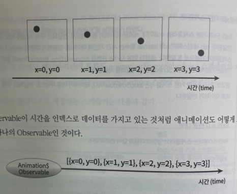

## 1.1 RxJS 스케쥴러

RxJS로 타이머 기반의 애니메이션을 구현하기 위해서는 스케쥴러에 대한 이해가 필수적이다.

Observable의 데이터 전달 시점과 Observer가 데이터를 받는 시점을 조절하는 일을 한다.

```jsx
// 일반 자바스크립트
function delay1s() {
  const start = new Date().getTime();
  while (new Date().getTime() - start < 1000) {
    //1s
  }
}
```

동기적으로 시간을 제어하려하면 자칫 치명적인 문제가 발생할 수 있다.

기본적으로 하나의 메인 스레드에서 모든 작업이 실행된다. 어떤 작업의 비용이 크거나 대기 시간이 긴 경우에는 애플리케이션 자체가 멈출 수 있다는 의미이기도 하다.

자바스크립트에서는 `setTimeout`, `setInterval` 과 같은 callback이나 `promise`, `async-await` 과 같은 표준 스펙을 통한 비동기 처리로 문제점을 해결하고 있다. 이런 비동기 작업은 하나의 메인 스레드가 계속 점유되지 않도록 한다.

RxJS에서도 단일 스레드에서 동기적으로 작업을 처리할 수 있지만 브라우저가 블록되는 문제를 해결하기 위해서 비동기적 처리 방식으로 데이터를 전달하거나 받는다. 이것이 바로 RxJS 스케쥴러이다.

> 프로그래밍 언어의 스케쥴러를 효과적으로 사용할 수 있도록 만든 가상의 스케쥴러다.

### 1.1.1 스케줄러는 언제 쓰나요?

```jsx
from(ish: ObservableInput<T>, scheduler: Scheduler);
interval(period: number, scheduler: Scheduler);
of(values: ...T, scheduler: Scheduler);
throwError(error: any, scheduler: Scheduler)
...
```

대다수 RxJS 네임스페이스에서 제공하는 함수에는 추가적으로 스케줄러를 지정할 수 있는 파라미터가 있다.

```jsx
const { of } = rxjs;
const { tap } = rxjs.operators;

const obs$ = of('A', 'B', 'C').pipe(
  tap(v => console.log(v, '데이터 처리1')),
  tap(v => console.log(v, '데이터 처리2')),
  tap(v => console.log(v, '데이터 처리3')),
  tap(v => console.log(v, '데이터 처리4'))
);

console.log('subscribe 전');
setTimeout(() => {
  const start = new Date().getTime();
  console.log('[1초 후 subscribe]');
  obs$.subscribe(v => console.log('observer recevied', v));
  console.log(`subscribe 후 ${new Date().getTime() - start} ms`);
}, 1000);
```

Observer가 Observable을 구독했을 때 Observable은 동기적으로 데이터를 처리해서 동기적으로 ‘A’, ‘B’, ‘C’를 전달하였다. 총 68ms동안 메인스레드는 멈춰있었떤 것이다.

두 가지 관점으로 분리할 수 있다.

- 구독 자체의 동기식 처리 여부
- 데이터 처리에 대한 동기식 처리 여부

구독의 시점을 제어할 수 있는 `subscribeOn` 오퍼레이터를 제공한다. `subscribeOn`을 이용하여 `asnycScheduler`를 사용하면 제어권을 메인 스레드에게 넘길 수 있다.

```jsx
const { of, asyncScheduler } = rxjs;
const { tap, subscribeOn } = rxjs.operators;

const obs$ = of('A', 'B', 'C').pipe(
  tap(v => console.log(v, '데이터 처리1')),
  tap(v => console.log(v, '데이터 처리2')),
  tap(v => console.log(v, '데이터 처리3')),
  tap(v => console.log(v, '데이터 처리4')),
  subscribeOn(asyncScheduler)
);
console.log('subscribe 전');
setTimeout(() => {
  const start = new Date().getTime();
  console.log('[1초 후 subscribe]');
  obs$.subscribe(v => console.log('observer recevied', v));
  console.log(`subscribe 후 ${new Date().getTime() - start} ms`);
}, 1000);
```

RxJS에서는 데이터 처리의 시점을 제어할 수 있도록 observeOn 오퍼레이터를 제공한다.

```jsx
const obs$ = of('A', 'B', 'C').pipe(
  tap(v => console.log(v, '데이터 처리1')),
  tap(v => console.log(v, '데이터 처리2')),
  tap(v => console.log(v, '데이터 처리3')),
  tap(v => console.log(v, '데이터 처리4')),
  observeOn(asyncScheduler),
  subscribeOn(asyncScheduler)
);

console.log('subscribe 전');
setTimeout(() => {
  const start = new Date().getTime();
  console.log('[1초 후 subscribe]');
  obs$.subscribe(v => console.log('observer recevied', v));
  console.log(`subscribe 후 ${new Date().getTime() - start} ms`);
}, 1000);
```

RxJS에서 공식적으로 제공하는 스케줄러는 다음과 같다.

| 스케쥴러                | 설명                                                                                                                         | 용도                                                                                                                                  |
| ----------------------- | ---------------------------------------------------------------------------------------------------------------------------- | ------------------------------------------------------------------------------------------------------------------------------------- |
| null                    | 스케쥴러가 없는 경우에는 동기적으로 데이터를 전달한다.                                                                       | RxJS 5+의 기본 스케줄러이다. 비용이 오래 걸리지 않는 경우 이용한다. Observable이 complete되어야 메인 스레드가 멈추지 않는다.          |
| queueScheduler          | 자료 구조 큐(Queue)와 같이 동작하는 스케줄러다.                                                                              | 현재 작업을 대기열(Queue)에 등록하고 가장 먼저 들어온 작업을 꺼내어 동기적으로 처리한다. 반복적인 작업을 처리해야 하는 경우 사용된다. |
| asapScheduler           | 마이크로태스크(microtask)대기열에 등록되는 스케줄러이다. setImmediate, Node.js의 process.nextTick()로 동작하는 스케줄러이다. | 주로 비동기 변환 처리를 할 경우에 사용된다.                                                                                           |
| asyncScheduler          | setInterval로 동작하는 스케줄러이다.                                                                                         | 시간과 관련된 오퍼레이터에 사용한다.                                                                                                  |
| animationFrameScheduler | requestAnamiationFrame로 동작하는 스케줄러이다.                                                                              | 부드러운 애니메이션을 만들 때 사용한다.                                                                                               |

## 1.2 애니메이션 구현하기

애니메이션은 시간이 경과함에 따라 좌표 정보가 변경되는 것을 의미한다.



Observable이 시간을 인덱스로 데이터를 가지고 있는 것처럼 애니메이션도 어떻게 보면 하나의 Observable인 것이다.

각 데이터의 간격을 시간에 따라 조절하기만 하면 우리가 원하는 애니메이션을 Observable을 이용하여 손쉽게 표현할 수 있다.

이처럼 각 데이터 간격을 조절하고 데이터 구조를 결정할 수 있는 것이 RxJS 스케줄러이다. 우리 예제에서는 requestAnimationFrame과 같이 동작하는 animationFrame 스케줄러를 이용하여 애니메이션을 표현하는 Observable을 만들어보자

### 1.2.1 Animation Observable 만들기

```jsx
const { animationFrameScheduler, interval } = rxjs;

const scheduler = animationFrameScheduler;
const animation$ = interval(0, scheduler);
```

### 1.2.2 이동 시간에 따른 ‘이동 거리 비율’ 구하기

이동해야 할 거리

> 경과시간 / 총 애니메이션 이동 시간

경과시간

> (현재 시간 - 애니메이션 시작 시간) / 총 애니메이션 이동 시간

```jsx
const { animationFrameScheduler, interval } = rxjs;

const scheduler = animationFrameScheduler;
const start = scheduler.now();
const DURATION = 300;
const animation$ = interval(0, scheduler).pipe(
  map(() => (scheduler.now() - start) / DURATION)
);
```

### 1.2.3 takeWhile로 애니메이션 종료하기

특정 조건이 만족되지 않을 경우 Observable을 완료(complete)시키는 takeWhile 오퍼레이터가 있다.


```jsx
const animation$ = interval(0, scheduler).pipe(
  map(() => (scheduler.now() - start) / DURATION),
  takeWhile(rate => rate <= 1)
);
```

### 1.2.4 concat으로 애니메이션 완료 값 1 전달하기

완료된 Observable에 추가적으로 데이터를 전달하기 위한 방법으로 concat 오퍼레이터가 있다.


```jsx
const interval$ = interval(0, scheduler).pipe(
  map(() => (scheduler.now() - start) / DURATION),
  takeWhile(rate => rate <= 1)
);

const animation$ = concat(interval$, of(1));
```

출처 [RxJS Quick Start](https://m.yes24.com/Goods/Detail/62601794)
